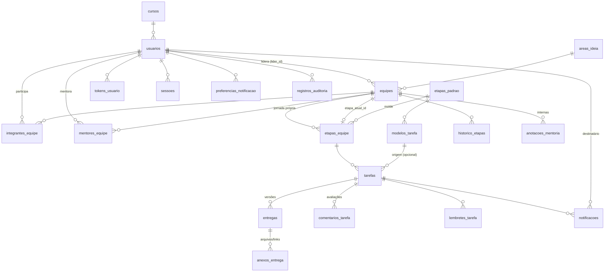

# Banco de dados — InfoHub → InovAMF

PostgreSQL + Prisma 7 (ORM e migrations). Fonte da verdade: [`prisma/schema.prisma`](../prisma/schema.prisma).
Tabelas e colunas em português (snake_case); no código TypeScript os campos ficam em camelCase.

## Como operar

```bash
npm install
cp .env.example .env        # ajuste DATABASE_URL (com ?schema=...)
npm run db:preparar         # schema → migrations → seed (é o que o `npm start` roda em todo deploy)
npm run db:studio           # navegar nos dados
```

| Script            | O que faz                                                                 |
| ----------------- | ------------------------------------------------------------------------- |
| `db:preparar`     | `db:schema` + `db:deploy` + `db:seed`, nessa ordem — a exigência da G1 ("o seed cria schema, tabelas e inserts") em um comando. Roda no `npm start`. |
| `db:schema`       | `scripts/criar-schema.cjs` — `CREATE SCHEMA` do `?schema=` da URL, se ainda não existir (recusa `public`). |
| `db:deploy`       | `prisma migrate deploy` — aplica as migrations pendentes (idempotente).  |
| `db:migrate`      | `prisma migrate dev` — cria uma nova migration a partir do schema (dev).  |
| `db:seed`         | `prisma db seed` → `prisma/seed.ts` (idempotente).                        |
| `db:status`       | Mostra migrations aplicadas/pendentes.                                    |
| `db:generate`     | Regera o Prisma Client em `backend/src/generated/prisma` (roda no `build`).       |
| `db:reset` / `db:push` | Destrutivos. Passam por `scripts/checar-schema.cjs` (ver abaixo).     |
| `db:recriar`      | `db:reset --force` + `db:seed`: volta o schema ao cenário inicial da G1 sem perguntar (terminal do container ou máquina na rede da AMF). |

### ⚠️ O banco da faculdade é compartilhado

O servidor `192.168.49.161` tem um único database `postgres` usado por **todas as duplas**, cada uma no seu
schema (`cairo_matheus`, `dupla_lorenzo_luiz`, …). O `public` pertence a outro grupo. Por isso:

* A `DATABASE_URL` **sempre** termina com `?schema=infohub_losekann`. Migrations, seeds e `reset` só tocam esse schema.
* O driver `pg` ignora o `?schema=`; `backend/src/lib/prisma.ts` extrai o nome da URL e o aplica ao adapter e ao `search_path`.
  Sem isso o client gravaria no `public` de outro grupo (foi o que aconteceu na primeira tentativa de seed).
* A mesma conexão fixa `TimeZone=UTC` na sessão: o Prisma envia e lê datas sem fuso, e o servidor da faculdade roda em
  America/Sao_Paulo — sem isso todo TIMESTAMPTZ gravado ficava 3 h deslocado em relação ao `now()` do banco.
* `db:reset` e `db:push` abortam se a URL não tiver `schema=` ou se for `public`.

Para desenvolvimento isolado há um Postgres local em `docker-compose.dev.yml`.

### Criando uma nova migration

1. Edite `prisma/schema.prisma`.
2. `npm run db:migrate -- --name descricao_curta` (precisa de um banco de desenvolvimento; o usuário `arquitetura`
   tem permissão para o shadow database temporário que o Prisma cria e apaga).
3. Revise o SQL gerado em `prisma/migrations/<timestamp>_descricao_curta/migration.sql` e commite a pasta.
4. Em produção o `npm start` roda `db:preparar` (schema → `migrate deploy` → seed) antes de subir o servidor.

Alternativa sem shadow database: `npx prisma migrate diff --from-migrations prisma/migrations --to-schema prisma/schema.prisma --script`
gera o SQL da diferença para colar numa pasta de migration criada à mão.

## Visão geral



## Tabelas

### Apoio
| Tabela        | Para quê                                                        | Requisitos |
| ------------- | --------------------------------------------------------------- | ---------- |
| `cursos`      | Cursos da faculdade (seed). Tabela para o admin poder incluir.  | RF-04, RF-07 |
| `areas_ideia` | Área/setor da ideia (seed).                                     | RF-04, RF-07 |

### Usuários e acesso
| Tabela           | Para quê | Requisitos |
| ---------------- | -------- | ---------- |
| `usuarios`       | Uma linha por pessoa. `perfil` = ADMIN, MENTOR ou ALUNO (líder e integrante são ALUNO). `senha_hash` **nulo** até o integrante ativar a conta. `email_confirmado_em` **nulo** até a pessoa provar que o e-mail é dela (validação do e-mail — sem isso o login é recusado). `ativo` (admin desativa), `consentimento_lgpd_em` (a própria pessoa aceita a política de privacidade: o líder no formulário, o colega e as contas criadas pela coordenação ao ativar a conta), `excluido_em` (anonimização). | RF-01, RF-02, RF-03, RNF-02 |
| `tokens_usuario` | Tokens de uso único enviados por e-mail: `ATIVACAO_CONTA` (integrante cadastrado pelo líder define a senha), `RECUPERACAO_SENHA` e `CONFIRMACAO_EMAIL` (líder, que se cadastra já com senha, confirma o e-mail). Guarda só o hash. | RF-01, RF-02 |
| `sessoes`        | Refresh tokens (rotativos, cookie httpOnly). Permite revogar sessões ao desativar/excluir conta. | RF-01, RNF-03 |

### Equipes e jornada
| Tabela               | Para quê | Requisitos |
| -------------------- | -------- | ---------- |
| `equipes`            | Equipe **e** ideia (mesma entidade). `lider_id` garante **um único líder** (Q1). `etapa_atual_id` aponta para a jornada da própria equipe. `status_jornada`: EM_ANDAMENTO → PRONTA_INOVAMF → ENCAMINHADA. `excluida_em` = exclusão lógica (Q4). `periodo_ingresso` ("2026/2") para o filtro por turma. | RF-05, RF-06, RF-07, RF-24, Q1, Q4 |
| `integrantes_equipe` | Alunos da equipe (líder incluso). `saiu_em` quando sai/é excluído. | RF-02, RN-03, RNF-02 |
| `mentores_equipe`    | Mentores atribuídos; delimita o que o mentor enxerga e pode mover. | Q2, RNF-03, RF-11 (nota) |
| `etapas_padrao`      | Catálogo fixo das 6 etapas (seed). Colunas do kanban. | RF-06 |
| `etapas_equipe`      | Jornada de **cada** equipe: cópia das 6 padrão feita no cadastro + etapas extras do mentor (`etapa_padrao_id` nulo). `ordem` única por equipe. Equipes antigas não mudam quando o catálogo muda. | Decisão da coordenação (padrão 6, ajustável por equipe) |
| `historico_etapas`   | Só INSERT: de/para, `direcao` (INICIO/AVANCO/RETROCESSO), `motivo`, `forcado` (avanço manual sem tarefas aprovadas), quem alterou. | RF-08, RF-09, RN-01, RNF-05 |

### Tarefas e entregas
| Tabela               | Para quê | Requisitos |
| -------------------- | -------- | ---------- |
| `modelos_tarefa`     | Modelos por etapa padrão (seed com 9). Os obrigatórios da etapa 6 são os entregáveis finais da RN-02 (Pitch Vídeo, Canvas final, VPD final, dados dos integrantes): a equipe só fica pronta para o InovAMF com uma tarefa aprovada de cada um (`tarefas.modelo_tarefa_id`). | RF-11, RN-02 |
| `tarefas`            | Tarefa de uma equipe, ligada a uma etapa da jornada dela. `prazo`, `status` (PENDENTE, EM_ANDAMENTO, ENTREGUE, ATRASADA, APROVADA, REPROVADA), `obrigatoria`. | RF-11, RF-12, RF-13, RN-01, RN-04 |
| `entregas`           | Um envio = uma versão (`versao` única por tarefa). Reenvio corrigido cria nova versão; nada é sobrescrito. | RF-14, RF-16 |
| `anexos_entrega`     | Um ou mais arquivos (ou links) por entrega. Metadados apenas; o binário fica no volume `uploads/`. | RF-14, RNF-04, Q3 |
| `comentarios_tarefa` | Avaliação (`decisao` APROVADA/REPROVADA sobre uma `entrega`) ou comentário livre. | RF-15, RNF-05 |

### Lembretes e notificações
| Tabela                      | Para quê | Requisitos |
| --------------------------- | -------- | ---------- |
| `lembretes_tarefa`          | Datas de lembrete por tarefa. `dias_antes` (relativo ao prazo) + `lembrar_em` (materializado) + `enviado_em`. | RF-17, RN-04 |
| `notificacoes`              | Fila **e** registro de todos os e-mails. `chave_idempotencia` única = garantia de não enviar duas vezes. `status`, `tentativas`, `proximo_envio_em`, `erro` = reenvio em caso de falha. `id_mensagem_provedor` = ID do e-mail na Resend (acha a mensagem no painel). Nos e-mails de segurança (ativação, recuperação, confirmação) o token do link sai do `corpo` assim que o e-mail é enviado — o banco nunca guarda token utilizável. | RF-18, RF-19, RF-20, RNF-05, RNF-06 |
| `preferencias_notificacao`  | Opt-out por tipo (sem linha = recebe). | RF-21 |

### Mentoria e auditoria
| Tabela                | Para quê | Requisitos |
| --------------------- | -------- | ---------- |
| `anotacoes_mentoria`  | Anotações internas; a API nunca devolve para ALUNO. | RF-10 |
| `registros_auditoria` | Quem fez o quê em qual registro (`acao`, `entidade`, `entidade_id`, `detalhes` JSON). `usuario_id` nulo = job. | RNF-05 |

## Regras de negócio — onde cada uma é garantida

| Regra | Banco | Serviço (backend) |
| ----- | ----- | ----------------- |
| Um líder por equipe (Q1) | `equipes.lider_id` (coluna única, NOT NULL) | Líder precisa estar em `integrantes_equipe`; promoção de outro integrante ao excluir o líder |
| Aluno em uma única equipe ativa (RN-03) | `UNIQUE (equipe_id, usuario_id)` | Verifica `saiu_em IS NULL` + equipe não excluída/encaminhada antes de incluir |
| Avanço só com obrigatórias aprovadas (RN-01) | `tarefas.obrigatoria`, `historico_etapas.forcado` | Consulta tarefas obrigatórias não aprovadas entre a etapa atual e a destino; mentor pode forçar (`forcado = true`, com motivo) |
| Só mentor/admin move etapa (nota RF-11) | `mentores_equipe` | Autorização: ADMIN qualquer equipe; MENTOR só as suas; ALUNO nunca |
| Etapas padrão = 6, extras por equipe | `etapas_equipe` (cópia por equipe) | Inserir extra reordena `ordem` em transação; extra só pode ser removida sem tarefas/histórico |
| Depois da última etapa → InovAMF | `status_jornada`, `pronta_em`, `encaminhada_em` | Na última etapa, com todas as obrigatórias aprovadas **e** os entregáveis finais da RN-02 aprovados → PRONTA_INOVAMF; coordenação marca ENCAMINHADA |
| Entregáveis finais obrigatórios (RN-02) | `modelos_tarefa` (obrigatórios da etapa 6), `tarefas.modelo_tarefa_id` | Cada modelo precisa de uma tarefa da equipe aprovada; o detalhe da equipe lista o que falta (`finalDeliverables`) e o mentor cria as que faltam de uma vez |
| Tarefa vencida vira ATRASADA (RN-04) | índice `(status, prazo)` | Job periódico: `status IN (PENDENTE, EM_ANDAMENTO) AND prazo < now()` → ATRASADA + notificações |
| Lembretes acompanham o prazo (nota RF-17) | `lembretes_tarefa.dias_antes` | Ao alterar `prazo`, recalcula `lembrar_em` dos lembretes com `dias_antes`; os que já tinham saído e caem numa data futura voltam a valer (`enviado_em` nulo). Vários vencendo juntos para a mesma tarefa viram um e-mail só |
| Nunca enviar e-mail duplicado (RF-18/19) | `UNIQUE notificacoes.chave_idempotencia` | Chave = `TIPO:entidade:<id>:usuario:<id>` (em `PRAZO_PROXIMO`, `PRAZO_VENCIDO` e `TAREFA_ATRASADA` entra também o prazo: adiar a entrega libera um novo aviso); INSERT com `ON CONFLICT DO NOTHING` (ou `skipDuplicates`) |
| Reenvio em caso de falha (RNF-06) | `tentativas`, `proximo_envio_em` | Job reenvia PENDENTE/FALHOU com backoff; após N tentativas mantém FALHOU. Falha permanente (endereço inválido, domínio não verificado na Resend) não é reenviada. Cada envio leva a chave de idempotência `notificacao/<id>` na Resend |
| Só entra quem provou o e-mail | `usuarios.email_confirmado_em` | Login recusa nulo (`EMAIL_NOT_CONFIRMED`). Preenchido pelo link de confirmação (líder) ou ao definir a senha por link de ativação/recuperação |
| Exclusão lógica de equipe (Q4) | `equipes.excluida_em` | Listagens filtram `excluida_em IS NULL`; nada em cascata é apagado. Mentor e aluno deixam de enxergar a equipe e as tarefas dela (404); o admin consulta, mas nada mais é alterado (`TEAM_INACTIVE`) |
| Exclusão de aluno (RNF-02) | `usuarios.excluido_em`, FKs `SET NULL` | Anonimiza nome/e-mail/telefone, apaga sessões/tokens/preferências, fecha `integrantes_equipe.saiu_em`; se era líder, promove outro integrante ou exclui a equipe logicamente se não houver. Também limpa as cópias: e-mails pendentes para a pessoa são descartados e os enviados perdem endereço e conteúdo, o nome completo some dos e-mails enviados a outras pessoas, o e-mail sai de `registros_auditoria.detalhes` e o IP das ações dela |
| Retenção (RNF-02) | `sessoes`, `tokens_usuario`, `notificacoes`, `registros_auditoria` | Uma vez por dia o job apaga sessões encerradas há 30 dias, links usados/vencidos há 30 dias, e-mails enviados há 365 dias e registros de acesso (login/logout) há 180 dias — prazos em `RETENTION_*`. O histórico de negócio fica. Política em `docs/lgpd.md` |
| Backup (RNF-07) | todas as tabelas do schema | `BACKUP_INTERVAL_HOURS` (24 h) o job grava `infohub-<schema>-<data>.json.gz` em `BACKUP_DIR` (transação REPEATABLE READ) e espelha os uploads; guarda os `BACKUP_KEEP` mais novos. `npm run backup:restaurar` volta um deles |
| Cada perfil só vê o seu escopo (RNF-03, RF-10) | `integrantes_equipe`, `mentores_equipe` | Escopo aplicado em toda consulta; anotações nunca vão para ALUNO |
| Limite de tamanho/tipo de arquivo (RNF-04) | `tamanho_bytes`, `mime_type` | Validado no upload antes de gravar |

## Fluxos principais

**Cadastro (RF-02/RF-05).** Em uma transação: cria o líder (`ALUNO`, senha informada, `consentimento_lgpd_em`,
`email_confirmado_em` nulo) com um `tokens_usuario(CONFIRMACAO_EMAIL)` e e-mail `CONFIRMACAO_EMAIL`, cria cada colega (`ALUNO`, `senha_hash` e `consentimento_lgpd_em` nulos — ele aceita a política ao ativar a conta em `/definir-senha`) com um `tokens_usuario(ATIVACAO_CONTA)` e e-mail `ATIVACAO_CONTA`,
cria a equipe (`lider_id`, `periodo_ingresso`), copia as 6 `etapas_padrao` para `etapas_equipe`, aponta
`etapa_atual_id` para a ordem 1, grava `historico_etapas(INICIO)` e enfileira `notificacoes(NOVO_CADASTRO)` para
os admins.

**Entrega e avaliação (RF-14/15/16).** Aluno envia → nova `entregas` com `versao = max + 1` e N `anexos_entrega`;
tarefa vai para ENTREGUE; e-mail `ENTREGA_RECEBIDA` ao mentor. Mentor avalia → `comentarios_tarefa` com `decisao`;
tarefa vai para APROVADA ou REPROVADA; e-mail `ENTREGA_AVALIADA` ao aluno. Reenvio após REPROVADA gera a versão seguinte.

**Job (RN-04, RF-17, RF-18, RF-19, RNF-02, RNF-06, RNF-07).** A cada X minutos: (1) marca tarefas vencidas como
ATRASADA e enfileira `PRAZO_VENCIDO` (aluno) e `TAREFA_ATRASADA` (mentor/admin); (2) para `lembretes_tarefa` com
`lembrar_em <= now()` e `enviado_em` nulo enfileira `PRAZO_PROXIMO` (um por tarefa, mesmo que vários lembretes vençam
juntos) e marca `enviado_em`; (3) envia `notificacoes` PENDENTE/FALHOU cujo `proximo_envio_em` já passou, atualizando
`status`, `tentativas`, `enviada_em` + `id_mensagem_provedor` / `erro`; (4) uma vez por dia, aplica a retenção; (5) gera
o backup quando o último passou de `BACKUP_INTERVAL_HOURS`.

## Seeds

`prisma/seed.ts` roda em todo deploy (`npm start` → `db:preparar`) e é idempotente:

* **Sempre:** 8 cursos, 7 áreas, 6 etapas padrão, 9 modelos de tarefa e o admin (`SEED_ADMIN_EMAIL` / `SEED_ADMIN_SENHA`
  no `.env` — **troque a senha padrão antes de expor o sistema**).
* **Cenário da G1** (a menos que `SEED_DEMO=false`), exatamente como o professor pediu:

  | Equipe         | Integrantes (líder em negrito)                                       | Mentor  | Situação |
  | -------------- | -------------------------------------------------------------------- | ------- | -------- |
  | **EcoTrack**   | **Lucas Oliveira**, Fernanda Lima, João Pedro Martins                | Ana     | Etapa 1 aprovada → **Etapa 2**; tarefa "Confirmar agendamento do 1º encontro" pendente (vence em 5 dias). |
  | **MedConnect** | **Mariana Santos**, Carlos Eduardo Pinto, Beatriz Nunes              | Ana     | Etapa 1 aprovada → **Etapa 2**; a tarefa da etapa 2 venceu há 4 dias → **ATRASADA**. |
  | **AgroSense**  | **Pedro Henrique Costa**, Ana Clara Souza, Rafael Torres, Isabela Rocha | Ricardo | **Etapa 1**; "Cadastro da ideia" **entregue**, aguardando avaliação. |

  Mentores: Ana Beatriz Ramos (2 equipes), Ricardo Ferreira (1), Paula Andrade e Marcos Vieira (nenhuma — para o admin
  atribuir ao vivo). Tudo gravado como se tivesse passado pelos fluxos: `historico_etapas` (INICIO e AVANCO 1 → 2 pela
  mentora), `entregas` com um PDF real em `UPLOADS_DIR/demo/` (dá para baixar), `comentarios_tarefa` com a decisão,
  `lembretes_tarefa` (3 e 1 dias antes; os que já dispararam constam como enviados), `notificacoes` já ENVIADAS com as
  mesmas chaves de idempotência dos serviços (o job não reenvia nada) e `registros_auditoria`.

  Se o cenário já existir (o líder da EcoTrack está cadastrado), o seed o mantém — um redeploy não desfaz o que foi
  mexido na apresentação. Para voltar ao estado inicial: `npm run db:recriar`.

Credenciais da demonstração:

| Perfil     | E-mail                                         | Senha        |
| ---------- | ---------------------------------------------- | ------------ |
| Admin      | `admin@infohub.amf.edu.br`                     | `Admin@123`  |
| Mentor     | `ana@amf.edu.br` (EcoTrack e MedConnect)       | `Mentor@123` |
| Mentor     | `ricardo@amf.edu.br` (AgroSense)               | `Mentor@123` |
| Mentor     | `paula@amf.edu.br`, `marcos@amf.edu.br` (sem equipe) | `Mentor@123` |
| Líder      | `lucas@aluno.amf.edu.br` (EcoTrack)            | `Aluno@123`  |
| Líder      | `mariana@aluno.amf.edu.br` (MedConnect)        | `Aluno@123`  |
| Líder      | `pedro@aluno.amf.edu.br` (AgroSense)           | `Aluno@123`  |
| Integrante | `fernanda@aluno.amf.edu.br` (EcoTrack)         | `Aluno@123`  |
