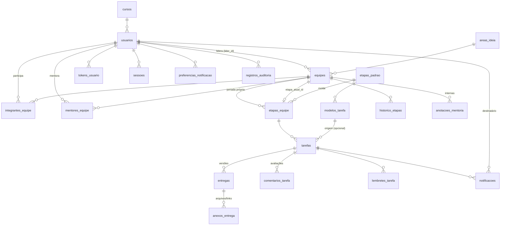

# Banco de dados — InfoHub → InovAMF

PostgreSQL + Prisma 7 (ORM e migrations). Fonte da verdade: [`prisma/schema.prisma`](../prisma/schema.prisma).
Tabelas e colunas em português (snake_case); no código TypeScript os campos ficam em camelCase.

## Como operar

```bash
npm install
cp .env.example .env        # ajuste DATABASE_URL (com ?schema=...)
npm run db:deploy           # aplica as migrations pendentes (idempotente)
npm run db:seed             # dados de referência (+ demo se SEED_DEMO=true)
npm run db:studio           # navegar nos dados
```

| Script            | O que faz                                                                 |
| ----------------- | ------------------------------------------------------------------------- |
| `db:deploy`       | `prisma migrate deploy` — aplica migrations. É o que roda no `npm start`. |
| `db:migrate`      | `prisma migrate dev` — cria uma nova migration a partir do schema (dev).  |
| `db:seed`         | `prisma db seed` → `prisma/seed.ts`.                                      |
| `db:status`       | Mostra migrations aplicadas/pendentes.                                    |
| `db:generate`     | Regera o Prisma Client em `backend/src/generated/prisma` (roda no `build`).       |
| `db:reset` / `db:push` | Destrutivos. Passam por `scripts/checar-schema.cjs` (ver abaixo).     |

### ⚠️ O banco da faculdade é compartilhado

O servidor `192.168.49.161` tem um único database `postgres` usado por **todas as duplas**, cada uma no seu
schema (`cairo_matheus`, `dupla_lorenzo_luiz`, …). O `public` pertence a outro grupo. Por isso:

* A `DATABASE_URL` **sempre** termina com `?schema=infohub_losekann`. Migrations, seeds e `reset` só tocam esse schema.
* O driver `pg` ignora o `?schema=`; `backend/src/lib/prisma.ts` extrai o nome da URL e o aplica ao adapter e ao `search_path`.
  Sem isso o client gravaria no `public` de outro grupo (foi o que aconteceu na primeira tentativa de seed).
* `db:reset` e `db:push` abortam se a URL não tiver `schema=` ou se for `public`.

Para desenvolvimento isolado há um Postgres local em `docker-compose.dev.yml`.

### Criando uma nova migration

1. Edite `prisma/schema.prisma`.
2. `npm run db:migrate -- --name descricao_curta` (precisa de um banco de desenvolvimento; o usuário `arquitetura`
   tem permissão para o shadow database temporário que o Prisma cria e apaga).
3. Revise o SQL gerado em `prisma/migrations/<timestamp>_descricao_curta/migration.sql` e commite a pasta.
4. Em produção o `npm start` roda `migrate deploy` antes de subir o servidor.

Alternativa sem shadow database: `npx prisma migrate diff --from-migrations prisma/migrations --to-schema prisma/schema.prisma --script`
gera o SQL da diferença para colar numa pasta de migration criada à mão.

## Visão geral



## Tabelas

### Apoio
| Tabela        | Para quê                                                        | Requisitos |
| ------------- | --------------------------------------------------------------- | ---------- |
| `cursos`      | Cursos da faculdade (seed). Tabela para o admin poder incluir.  | RF-04, RF-07 |
| `areas_ideia` | Área/setor da ideia (seed).                                     | RF-04, RF-07 |

### Usuários e acesso
| Tabela           | Para quê | Requisitos |
| ---------------- | -------- | ---------- |
| `usuarios`       | Uma linha por pessoa. `perfil` = ADMIN, MENTOR ou ALUNO (líder e integrante são ALUNO). `senha_hash` **nulo** até o integrante ativar a conta. `ativo` (admin desativa), `consentimento_lgpd_em`, `excluido_em` (anonimização). | RF-01, RF-02, RF-03, RNF-02 |
| `tokens_usuario` | Tokens de uso único enviados por e-mail: `ATIVACAO_CONTA` (integrante cadastrado pelo líder define a senha) e `RECUPERACAO_SENHA`. Guarda só o hash. | RF-01, RF-02 |
| `sessoes`        | Refresh tokens (rotativos, cookie httpOnly). Permite revogar sessões ao desativar/excluir conta. | RF-01, RNF-03 |

### Equipes e jornada
| Tabela               | Para quê | Requisitos |
| -------------------- | -------- | ---------- |
| `equipes`            | Equipe **e** ideia (mesma entidade). `lider_id` garante **um único líder** (Q1). `etapa_atual_id` aponta para a jornada da própria equipe. `status_jornada`: EM_ANDAMENTO → PRONTA_INOVAMF → ENCAMINHADA. `excluida_em` = exclusão lógica (Q4). `periodo_ingresso` ("2026/2") para o filtro por turma. | RF-05, RF-06, RF-07, RF-24, Q1, Q4 |
| `integrantes_equipe` | Alunos da equipe (líder incluso). `saiu_em` quando sai/é excluído. | RF-02, RN-03, RNF-02 |
| `mentores_equipe`    | Mentores atribuídos; delimita o que o mentor enxerga e pode mover. | Q2, RNF-03, RF-11 (nota) |
| `etapas_padrao`      | Catálogo fixo das 6 etapas (seed). Colunas do kanban. | RF-06 |
| `etapas_equipe`      | Jornada de **cada** equipe: cópia das 6 padrão feita no cadastro + etapas extras do mentor (`etapa_padrao_id` nulo). `ordem` única por equipe. Equipes antigas não mudam quando o catálogo muda. | Decisão da coordenação (padrão 6, ajustável por equipe) |
| `historico_etapas`   | Só INSERT: de/para, `direcao` (INICIO/AVANCO/RETROCESSO), `motivo`, `forcado` (avanço manual sem tarefas aprovadas), quem alterou. | RF-08, RF-09, RN-01, RNF-05 |

### Tarefas e entregas
| Tabela               | Para quê | Requisitos |
| -------------------- | -------- | ---------- |
| `modelos_tarefa`     | Modelos por etapa padrão (seed com 9). Os da etapa 6 são os entregáveis obrigatórios. | RF-11, RN-02 |
| `tarefas`            | Tarefa de uma equipe, ligada a uma etapa da jornada dela. `prazo`, `status` (PENDENTE, EM_ANDAMENTO, ENTREGUE, ATRASADA, APROVADA, REPROVADA), `obrigatoria`. | RF-11, RF-12, RF-13, RN-01, RN-04 |
| `entregas`           | Um envio = uma versão (`versao` única por tarefa). Reenvio corrigido cria nova versão; nada é sobrescrito. | RF-14, RF-16 |
| `anexos_entrega`     | Um ou mais arquivos (ou links) por entrega. Metadados apenas; o binário fica no volume `uploads/`. | RF-14, RNF-04, Q3 |
| `comentarios_tarefa` | Avaliação (`decisao` APROVADA/REPROVADA sobre uma `entrega`) ou comentário livre. | RF-15, RNF-05 |

### Lembretes e notificações
| Tabela                      | Para quê | Requisitos |
| --------------------------- | -------- | ---------- |
| `lembretes_tarefa`          | Datas de lembrete por tarefa. `dias_antes` (relativo ao prazo) + `lembrar_em` (materializado) + `enviado_em`. | RF-17, RN-04 |
| `notificacoes`              | Fila **e** registro de todos os e-mails. `chave_idempotencia` única = garantia de não enviar duas vezes. `status`, `tentativas`, `proximo_envio_em`, `erro` = reenvio em caso de falha. | RF-18, RF-19, RF-20, RNF-05, RNF-06 |
| `preferencias_notificacao`  | Opt-out por tipo (sem linha = recebe). | RF-21 |

### Mentoria e auditoria
| Tabela                | Para quê | Requisitos |
| --------------------- | -------- | ---------- |
| `anotacoes_mentoria`  | Anotações internas; a API nunca devolve para ALUNO. | RF-10 |
| `registros_auditoria` | Quem fez o quê em qual registro (`acao`, `entidade`, `entidade_id`, `detalhes` JSON). `usuario_id` nulo = job. | RNF-05 |

## Regras de negócio — onde cada uma é garantida

| Regra | Banco | Serviço (backend) |
| ----- | ----- | ----------------- |
| Um líder por equipe (Q1) | `equipes.lider_id` (coluna única, NOT NULL) | Líder precisa estar em `integrantes_equipe`; promoção de outro integrante ao excluir o líder |
| Aluno em uma única equipe ativa (RN-03) | `UNIQUE (equipe_id, usuario_id)` | Verifica `saiu_em IS NULL` + equipe não excluída/encaminhada antes de incluir |
| Avanço só com obrigatórias aprovadas (RN-01) | `tarefas.obrigatoria`, `historico_etapas.forcado` | Consulta tarefas obrigatórias não aprovadas entre a etapa atual e a destino; mentor pode forçar (`forcado = true`, com motivo) |
| Só mentor/admin move etapa (nota RF-11) | `mentores_equipe` | Autorização: ADMIN qualquer equipe; MENTOR só as suas; ALUNO nunca |
| Etapas padrão = 6, extras por equipe | `etapas_equipe` (cópia por equipe) | Inserir extra reordena `ordem` em transação; extra só pode ser removida sem tarefas/histórico |
| Depois da última etapa → InovAMF | `status_jornada`, `pronta_em`, `encaminhada_em` | Ao concluir a última etapa com obrigatórias aprovadas → PRONTA_INOVAMF; coordenação marca ENCAMINHADA |
| Tarefa vencida vira ATRASADA (RN-04) | índice `(status, prazo)` | Job periódico: `status IN (PENDENTE, EM_ANDAMENTO) AND prazo < now()` → ATRASADA + notificações |
| Lembretes acompanham o prazo (nota RF-17) | `lembretes_tarefa.dias_antes` | Ao alterar `prazo`, recalcula `lembrar_em` dos lembretes com `dias_antes` não nulo e `enviado_em` nulo |
| Nunca enviar e-mail duplicado (RF-18/19) | `UNIQUE notificacoes.chave_idempotencia` | Chave = `TIPO:entidade:<id>:usuario:<id>`; INSERT com `ON CONFLICT DO NOTHING` (ou `skipDuplicates`) |
| Reenvio em caso de falha (RNF-06) | `tentativas`, `proximo_envio_em` | Job reenvia PENDENTE/FALHOU com backoff; após N tentativas mantém FALHOU |
| Exclusão lógica de equipe (Q4) | `equipes.excluida_em` | Listagens filtram `excluida_em IS NULL`; nada em cascata é apagado |
| Exclusão de aluno (RNF-02) | `usuarios.excluido_em`, FKs `SET NULL` | Anonimiza nome/e-mail/telefone, revoga sessões/tokens, fecha `integrantes_equipe.saiu_em`; se era líder, promove outro integrante ou exclui a equipe logicamente se não houver |
| Cada perfil só vê o seu escopo (RNF-03, RF-10) | `integrantes_equipe`, `mentores_equipe` | Escopo aplicado em toda consulta; anotações nunca vão para ALUNO |
| Limite de tamanho/tipo de arquivo (RNF-04) | `tamanho_bytes`, `mime_type` | Validado no upload antes de gravar |

## Fluxos principais

**Cadastro (RF-02/RF-05).** Em uma transação: cria o líder (`ALUNO`, senha informada, `consentimento_lgpd_em`),
cria cada colega (`ALUNO`, `senha_hash` nulo) com um `tokens_usuario(ATIVACAO_CONTA)` e e-mail `ATIVACAO_CONTA`,
cria a equipe (`lider_id`, `periodo_ingresso`), copia as 6 `etapas_padrao` para `etapas_equipe`, aponta
`etapa_atual_id` para a ordem 1, grava `historico_etapas(INICIO)` e enfileira `notificacoes(NOVO_CADASTRO)` para
os admins.

**Entrega e avaliação (RF-14/15/16).** Aluno envia → nova `entregas` com `versao = max + 1` e N `anexos_entrega`;
tarefa vai para ENTREGUE; e-mail `ENTREGA_RECEBIDA` ao mentor. Mentor avalia → `comentarios_tarefa` com `decisao`;
tarefa vai para APROVADA ou REPROVADA; e-mail `ENTREGA_AVALIADA` ao aluno. Reenvio após REPROVADA gera a versão seguinte.

**Job (RN-04, RF-17, RF-18, RF-19, RNF-06).** A cada X minutos: (1) marca tarefas vencidas como ATRASADA e enfileira
`PRAZO_VENCIDO` (aluno) e `TAREFA_ATRASADA` (mentor/admin); (2) para `lembretes_tarefa` com `lembrar_em <= now()` e
`enviado_em` nulo enfileira `PRAZO_PROXIMO` e marca `enviado_em`; (3) envia `notificacoes` PENDENTE/FALHOU cujo
`proximo_envio_em` já passou, atualizando `status`, `tentativas`, `enviada_em`/`erro`.

## Seeds

`prisma/seed.ts` é idempotente:

* **Sempre:** 8 cursos, 7 áreas, 6 etapas padrão, 9 modelos de tarefa e o admin (`SEED_ADMIN_EMAIL` / `SEED_ADMIN_SENHA`
  no `.env` — **troque a senha padrão antes de expor o sistema**).
* **Com `SEED_DEMO=true`:** 2 mentores, 8 equipes espalhadas pelas 6 etapas (uma já PRONTA_INOVAMF), 13 tarefas em todos os
  status, entregas com múltiplas versões e um link, avaliações, lembretes, anotações, notificações e auditoria.
  Se a demo já existir, o seed a pula; `npm run db:reset` recria tudo.

Credenciais da demonstração:

| Perfil  | E-mail                       | Senha       |
| ------- | ---------------------------- | ----------- |
| Admin   | `admin@infohub.amf.edu.br`   | `Admin@123` |
| Mentor  | `ana@amf.edu.br`             | `Mentor@123`|
| Mentor  | `ricardo@amf.edu.br`         | `Mentor@123`|
| Líder   | `lucas@aluno.amf.edu.br` (EcoTrack) | `Aluno@123` |
| Integrante | `fernanda@aluno.amf.edu.br` (EcoTrack) | `Aluno@123` |
